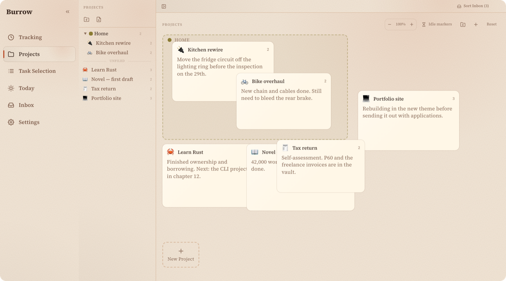
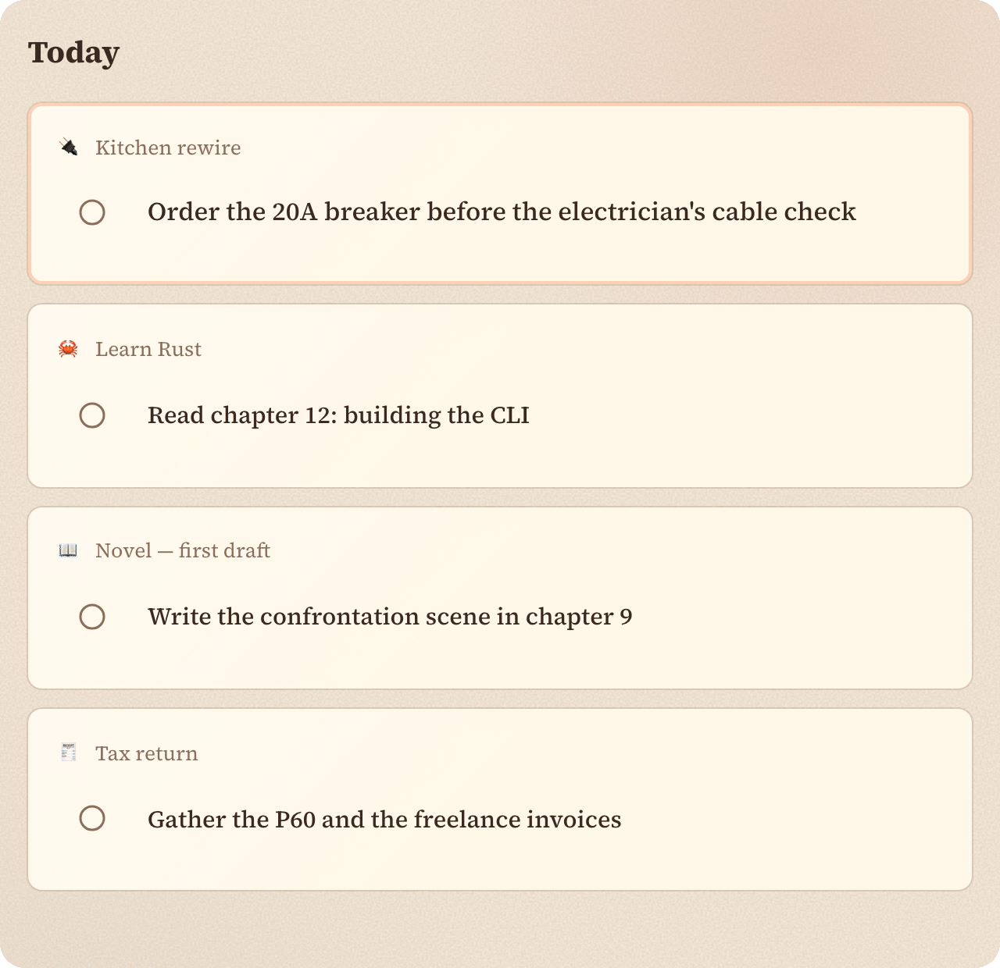

<!-- craft-readme: voice=quiet -->
<div align="center">

# JediNotebook

[](client/src-tauri/tauri.conf.json)
[](https://github.com/gr13nka/JediNotebook/actions/workflows/release.yml)
[](https://github.com/gr13nka/JediNotebook/releases)

**No account. No server. Kept on this device.**

Projects with tasks, time-boxed into today, this week, or someday. Kept in the browser's own database.

[Docs](docs/GUIDE.md)



</div>

## Today



The order commits the moment you let go. There's nothing to save.

## Quick start with an agent

> Read CLAUDE.md first. It has the architecture and the file layout. Then run `cd client && npm run dev`,
> make the change, and check it with `cd client && npx tsc --noEmit` and `cd client && npm run test`
> before committing.

## Quick start

```bash
cd client
npm install
npm run dev
```

Opens at `http://localhost:5173`.

## FAQ

**Does it sync across devices?** Only if you point two installs at the same folder and replicate it yourself. Syncthing is one way to do that. There's no server in between. [Vault sync →](docs/GUIDE.md#vault-sync)

**What happens if two devices edit the same task while offline?** Syncthing keeps one file and renames the other beside it as a `.sync-conflict-*` copy. The app reads both and merges them row by row, the newest `updatedAt` per task winning, then deletes the copy. Which file Syncthing kept is decided by modification time, which is not the same as the newer edit, so the merge does not rely on it. [Conflict resolution →](docs/vault-conflict-resolution.md)

**What does it track, and where does that go?** Time entries, tasks, and inbox captures, all in the browser's IndexedDB, on the device that made them. Nothing leaves unless you set up a vault.

## Docs

Everything else is in **[docs/GUIDE.md](docs/GUIDE.md)**: [running it locally](docs/GUIDE.md#running-it-locally) · [building the apps](docs/GUIDE.md#building-the-desktop-and-mobile-apps) · [vault sync](docs/GUIDE.md#vault-sync) · [themes](docs/GUIDE.md#themes).
